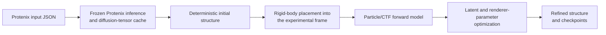

# CoCoFold2

**CoCoFold2: Diffusion-enabled Experimental Latent Test-time Adaptation of Frozen Protein Structure Priors**

CoCoFold2 is a deterministic experimental refinement framework that couples a frozen Protenix-style protein diffusion prior to cryo-EM particle observations. It fixes the diffusion sampling state and optimizes a target-specific latent bias, together with auxiliary Gaussian-rendering parameters, while keeping all pretrained network weights frozen.

## Workflow



## Current capabilities

- Uses a frozen Protenix-v1/AF3-style diffusion prior.
- Reuses cached Protenix conditional representations during iterative refinement.
- Keeps a fixed diffusion sampling state during target-specific optimization.
- Compares differentiably rendered model projections with raw cryo-EM particles using upstream poses and CTF parameters.
- Optimizes a target-specific `z_bias` together with Gaussian-rendering atom weights and Gaussian widths (`sdevs`).
- Writes epoch-wise coordinate models and PyTorch checkpoints for downstream inspection.
- Supports both pre-RELION-3.1 and RELION 3.1+ STAR metadata layouts implemented by `ParticleDataset`.

## Current limitations

- Particle poses and CTF parameters must be supplied by an upstream cryo-EM processing workflow and are held fixed.
- Initial rigid-body placement into the experimental coordinate frame is external to CoCoFold2.
- CoCoFold2 is not a pose-estimation or three-dimensional reconstruction pipeline.
- The current release does not model conformational ensembles or continuous heterogeneity.
- Memory use can be high and depends on target size, atom count, particle box size, diffusion settings and particle mini-batch size.
- The current implementation uses 10 epochs, random seed 42 and fixed learning rates hard-coded in `train.py`.

## Important scientific-use warning

The structure supplied to `train.py --cif_path` must be the **initial Protenix model after rigid-body placement into the experimental frame**. A deposited reference structure may be used retrospectively for evaluation, but it must not be used as the optimization target or as the rigid-fitting template for the reported experiment.

## Installation

An NVIDIA GPU is required. The tested environment uses Python 3.11, PyTorch 2.7.1 and CUDA 12.6-compatible NVIDIA drivers.

```bash
git clone https://github.com/jwliaomath/CoCoFold2.git
cd CoCoFold2
conda env create -f environment.yml
conda activate cocofold2
```

The current repository is run directly from its root and does not provide a `setup.py` or `pyproject.toml`; do not run `pip install -e .`.

CoCoFold2 depends on Protenix 1.0.2. Obtain the Protenix model parameters and required `checkpoint/` and `common/` resources according to the official [Protenix instructions](https://github.com/bytedance/Protenix) (You may simply run one prediction from the official Protenix and find the model parameters in the HOME ROOT). 

Environment recreation may require cluster-specific compiler, CUDA-driver and compiled-kernel adjustments. See [Troubleshooting](docs/troubleshooting.md).

## Quick start: the 6ZBH particle case

The first release uses a real research-scale 6ZBH case rather than a toy example.

```bash
cp examples/6zbh/env.sh.example examples/6zbh/env.sh
# Edit examples/6zbh/env.sh and replace all TODO values.

bash examples/6zbh/run_inference.sh
bash examples/6zbh/run_initial_prediction.sh

# Perform the one-time external rigid-body fit described in the tutorial,
# then run particle-guided refinement:
bash examples/6zbh/run_refinement.sh
```

Full instructions are provided in [Particle-guided CoCoFold2 refinement for 6ZBH](docs/particle_tutorial_6zbh.md). The required data fields are described in [Data requirements](docs/data_requirements.md).

## Inputs

The particle workflow requires:

- a Protenix input JSON and the sequence/MSA/template resources referenced by it;
- a compatible Protenix 1.0.2 model checkpoint and common-data resources;
- RELION-format particle metadata containing particle orientations, translations and CTF parameters;
- the referenced MRC/MRCS particle stack(s);
- a Protenix topology model and cached diffusion tensors;
- an initial model rigidly placed into the experimental coordinate frame;
- pixel size, box size and the frequency cutoff used for the particle loss.

## Outputs

The current `train.py` interface treats `--output_trained_model_dir` as a **filename prefix**, not as a conventional directory argument. For a prefix such as `outputs/6zbh/checkpoint_`, the workflow produces:

- an initial unrefined PDB written with the supplied topology template;
- one PDB model per epoch;
- one `.pth` checkpoint per epoch containing the frozen diffusion state, optimizer state, renderer parameters, cached representations, `z_bias`, current coordinates and configuration;
- stdout/stderr logs reporting FRC loss, renderer penalty, runtime and peak allocated GPU memory.

Large particle stacks, model weights and `.pth` caches should not be committed to Git.

## Reproducibility notes

- `train.py` currently fixes NumPy and PyTorch random seeds to 42.
- Diffusion sampling uses the cached deterministic sampling setup generated by `inference.py`.
- Numerical differences can still arise across GPUs, CUDA versions and compiled kernels.
- The source may store the trainable pair bias at either the cached `pair_z` representation or `z_trunk`, depending on whether shared diffusion variables were cached. The checkpoint records both cached fields and `z_bias`.

## Citation

Citation metadata are provided in [`CITATION.cff`](CITATION.cff). Until the manuscript DOI is available, cite the repository and the CoCoFold2 manuscript using the placeholder information in that file.


